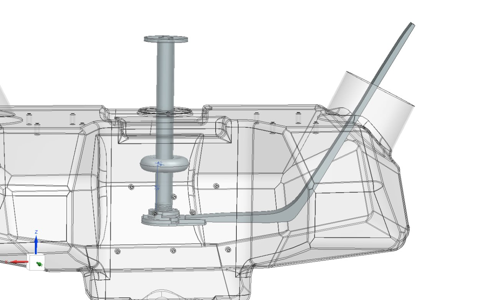
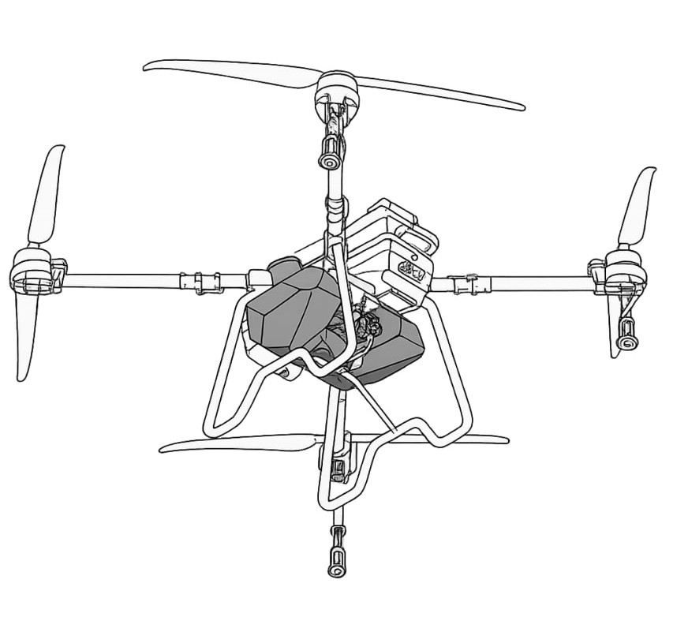
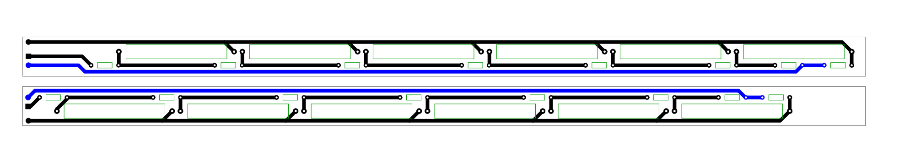

# **Project Fly** 

Reed Switch-Based Liquid Level Sesnor.



## 📌 Overview
A compact reed switch-based liquid level sensor designed for UAV-mounted tanks for agrochemicals. The sensor uses a magnetic float and hermetically sealed reed switches to reliably detect liquid levels in harsh environments.



## 🔧 Key Features 
- **No calibration needed**: float does not depend on liquid type
- **Robust signal**: sliding window median filter
- **Easy to install**: special assembling tool
- **Low power consumption**

## 🛠️ Hardware 
- **Key components**: Reed Switches 4x28 mm NC
- **Microcontroller**: STM32F103C8T6
- **Output**: Digital signal (UART)
- **Power**: 3.3V-5V



## 📚 Documentation
- [**Schematics sheet**](docs/schematics.pdf)
- [**Schematics description**](docs/schematics.md)
- [**Assembly guide**](docs/assembly.md)

## 📂 Project Structure
```
ProjectFly
├── cad         # 3D models
├── demos       # Demonstrations videos and images
├── docs        # Project documentation
├── firmware    # Embedded code
│   ├── arduino # Arduino-compatible firmware (for prototyping)
│   └── stm32   # STM32-optimized firmware (production version)
├── hardware    # Electronics design files
│   └── pcb     # PCB schematics and layouts
└── tests       # Validation scripts
```

## 👥 Team Members
### Hardware
- **Dmitriy Vizitei** - team leader, prototyping
- **Senya Belykh** - schematics, PCB design
- **Anas Hamrouni** - CAD modeling & design
### Software
- **Dmitry Ryabov** - programming, testing
### Documentation 
- **Andrew Pavlov** - documentation, reports